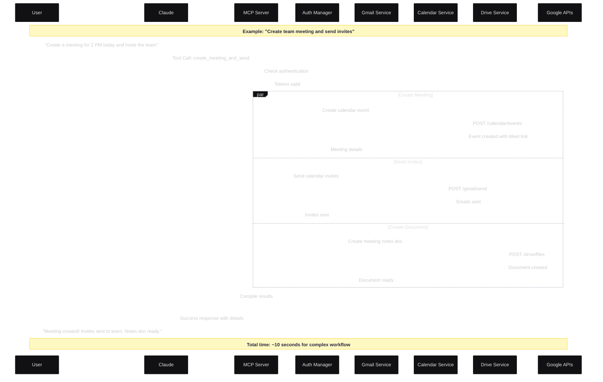
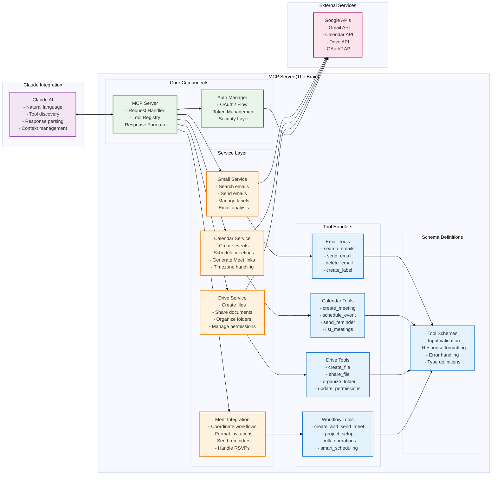

# Gmail Drive Calendar MCP Server

> Transform Claude into a Google Workspace powerhouse with this comprehensive MCP server integration.

[](https://nodejs.org/)
[](https://opensource.org/licenses/MIT)
[](https://modelcontextprotocol.io/)
[](https://developers.google.com/)

## What This Does

Turn Claude into your personal productivity assistant that can:

- **Manage Gmail** - Send, organize, search, and analyze emails
- **Control Google Calendar** - Create meetings, schedule events, send invites
- **Organize Google Drive** - Create, share, and manage files and folders  
- **Generate Google Meet links** - Instant video conferencing setup
- **Execute complex workflows** - Multi-step automation across all services

## Key Features

### Email Management
- Search emails with advanced Gmail queries
- Send professional emails with attachments
- Organize with labels, archive, star, delete
- Analyze email patterns and statistics
- Auto-manage inbox organization

### Meeting & Calendar
- Create Google Meet meetings instantly
- Schedule with natural language ("2 PM today")
- Automatic timezone handling for global teams
- Send calendar invites and reminders
- List and manage upcoming meetings

### File Operations
- Create and edit Google Docs, Sheets, Slides
- Organize files into structured folders
- Share files with granular permissions
- Collaborate with teams seamlessly
- Bulk file operations and management

### 🔄 Intelligent Workflows
- **Project Setup**: Create meeting + folder + invites in one command
- **Event Coordination**: Full event planning automation
- **Research Management**: Organize academic/professional research
- **Team Collaboration**: Streamline group project workflows


## Architecture

```mermaid
---
config:
  theme: default
---
graph TB
    User[User<br/>Master's Student] --> Claude[🤖 Claude AI<br/>Chat Interface]
    Claude <==> MCP[MCP Server<br/>The Brain<br/>Node.js + ES Modules]
    MCP --> Auth[OAuth2 Auth<br/>Token Management<br/>Security Layer]
    MCP --> Gmail[Gmail Service<br/>Email Operations]
    MCP --> Calendar[Calendar Service<br/>Meeting Management]
    MCP --> Drive[Drive Service<br/>File Operations]
    MCP --> Meet[Meet Integration<br/>Video Conferencing]
    Auth --> GoogleAuth[Google OAuth2<br/>Secure Authentication]
    Gmail --> GmailAPI[Gmail API<br/>Google Servers]
    Calendar --> CalendarAPI[Calendar API<br/>Google Servers]
    Drive --> DriveAPI[Drive API<br/>Google Servers]
    Meet --> MeetAPI[Meet API<br/>Google Servers]
    Claude -.->|"Create meeting for 2 PM"| MCP
    MCP -.->|"Tool Call: create_meeting"| Calendar
    Calendar -.->|"API Request"| CalendarAPI
    CalendarAPI -.->|"Meeting Created"| Calendar
    Calendar -.->|"Success Response"| MCP
    MCP -.->|"Meeting created successfully!"| Claude
    classDef userStyle fill:#e1f5fe,stroke:#0277bd,stroke-width:2px
    classDef claudeStyle fill:#f3e5f5,stroke:#7b1fa2,stroke-width:2px
    classDef mcpStyle fill:#e8f5e8,stroke:#2e7d32,stroke-width:3px
    classDef serviceStyle fill:#fff3e0,stroke:#f57c00,stroke-width:2px
    classDef apiStyle fill:#fce4ec,stroke:#c2185b,stroke-width:2px
    classDef authStyle fill:#fff8e1,stroke:#f9a825,stroke-width:2px
    class User userStyle
    class Claude claudeStyle
    class MCP mcpStyle
    class Gmail,Calendar,Drive,Meet serviceStyle
    class GmailAPI,CalendarAPI,DriveAPI,MeetAPI apiStyle
    class Auth,GoogleAuth authStyle
```



## Workflow



## Server Component



## Installation

### Prerequisites

- **Node.js 18+** installed
- **Google Cloud Project** with APIs enabled
- **Claude Pro subscription** (for MCP support)
- **OAuth2 credentials** from Google Cloud Console

### Step 1: Clone Repository

```bash
git clone https://github.com/SmitPatel-31/gmail-drive-mcp-server
cd gmail-drive-mcp-server
npm install
```

### Step 2: Google Cloud Setup

1. **Create Google Cloud Project**
   - Go to [Google Cloud Console](https://console.cloud.google.com/)
   - Create new project or select existing one

2. **Enable Required APIs**
   ```
   - Gmail API
   - Google Calendar API  
   - Google Drive API
   ```

3. **Create OAuth2 Credentials**
   - Go to "APIs & Services" → "Credentials"
   - Create "OAuth 2.0 Client IDs"
   - Download as `credentials.json`
   - Place in project root directory

### Step 3: Authentication Setup

```bash
# Run interactive authentication setup
node auth.js

# Follow the prompts to:
# 1. Visit the authorization URL
# 2. Grant permissions
# 3. Enter the authorization code
# 4. Tokens will be saved automatically
```

### Step 4: Start the Server

```bash
# Start the MCP server
npm start


### Step 5: Configure Claude

Add the MCP server to your Claude configuration:

```json
{
  "mcpServers": {
    "gmail-drive-server": {
      "command": "node",
      "args": ["path/to/your/server.js"],
      "env": {}
    }
  }
}
```

## Available Tools

### Gmail Operations
| Tool | Description | Example |
|------|-------------|---------|
| `search_emails` | Search emails with Gmail queries | *"Find emails from john@company.com about project"* |
| `send_email` | Send emails with attachments | *"Send progress update to the team"* |
| `delete_email` | Delete specific emails | *"Delete that spam email"* |
| `archive_email` | Archive emails | *"Archive all newsletters"* |
| `create_label` | Create Gmail labels | *"Create 'Important Projects' label"* |
| `analyze_email_patterns` | Email statistics and analytics | *"Show my email patterns from last month"* |

### Calendar & Meetings
| Tool | Description | Example |
|------|-------------|---------|
| `create_meeting` | Schedule meetings with Meet links | *"Create team meeting for 2 PM today"* |
| `create_quick_meet` | Instant meeting in 5 minutes | *"Quick standup meeting with the team"* |
| `create_instant_meet` | Meeting starting in 2 minutes | *"Emergency call right now"* |
| `create_meeting_natural` | Natural language scheduling | *"6 PM to 8 PM today for study group"* |
| `send_meet_reminder` | Send meeting reminders | *"Remind everyone about tomorrow's demo"* |
| `list_upcoming_meetings` | Show upcoming meetings | *"What meetings do I have this week?"* |

### Google Drive Operations  
| Tool | Description | Example |
|------|-------------|---------|
| `create_file` | Create documents, sheets, slides | *"Create project proposal document"* |
| `update_file` | Edit existing files | *"Update the meeting notes"* |
| `share_file` | Share with permissions | *"Share with edit access to the team"* |
| `create_folder` | Organize with folders | *"Create Q4 Planning folder"* |
| `move_file` | Reorganize files | *"Move all drafts to Final folder"* |
| `search_drive_files` | Find files quickly | *"Find all files containing 'budget'"* |

### Workflow Automation
| Tool | Description | Example |
|------|-------------|---------|
| `create_meet_and_send` | Meeting + email automation | *"Create client call and send professional invite"* |
| `project_setup` | Complete project initialization | *"Set up new website project with all resources"* |
| `bulk_email_management` | Process multiple emails | *"Organize my inbox and respond to urgent items"* |

## Usage Examples

### Academic Use Cases

```javascript
// Thesis defense preparation
"Set up my thesis defense for next Friday at 2 PM, invite my committee, create presentation template, and send preparation checklist"

// Group project coordination  
"Create our capstone project workspace: weekly meeting, shared folder, task tracking document, and team communication setup"

// Research organization
"Organize my literature review: create categorized folders, move research papers, and set up citation tracking"
```

### Professional Workflows

```javascript
// Client meeting setup
"Schedule client presentation for Thursday 10 AM, create agenda document, invite stakeholders, and send professional confirmation"

// Team collaboration
"Set up sprint planning: create meeting, invite dev team, prepare backlog document, and schedule follow-up sessions"

// Event coordination
"Organize company hackathon: create event calendar, set up registration, prepare resource folders, and coordinate communications"
```

### Personal Productivity

```javascript
// Weekly planning
"Set up my weekly review meeting, create planning template, organize last week's documents, and prepare agenda"

// Travel coordination
"Plan conference trip: create itinerary, share with team, set up out-of-office, and coordinate coverage meetings"
```


## 🔒 Security & Privacy

### Data Protection
- **OAuth2 Authentication**: Industry-standard secure authentication
- **Local Token Storage**: Tokens stored locally, never transmitted to third parties
- **Minimal Permissions**: Only requests necessary Google API scopes
- **No Data Collection**: Your data stays between you, Claude, and Google

### Best Practices
- Keep `credentials.json` and `token.json` secure
- Never commit authentication files to version control
- Regularly review Google account permissions
- Use environment variables for sensitive configuration

### Compliance
- GDPR compliant (no data collection)
- Student-friendly (works with educational accounts)
- Enterprise-ready (supports G Suite/Workspace)

## Troubleshooting

### Common Issues

**Authentication Errors**
```bash
# Clear tokens and re-authenticate
rm token.json
node test-auth.js
```

**API Rate Limits**
```bash
# Check quota usage in Google Cloud Console
# Implement exponential backoff (already included)
```

**Permission Errors**
```bash
# Verify API enablement
# Check OAuth2 scope configuration
# Confirm credentials.json format
```

**Timezone Issues**
```bash
# Set explicit timezone in requests
# Verify system timezone settings
# Use natural language with timezone context
```

### Error Codes

| Code | Description | Solution |
|------|-------------|----------|
| `AUTH_FAILED` | Authentication issues | Re-run auth setup |
| `API_QUOTA_EXCEEDED` | Rate limit reached | Wait and retry |
| `INVALID_PERMISSIONS` | Scope issues | Check OAuth2 scopes |
| `NETWORK_ERROR` | Connection problems | Check internet connection |


### Adding New Features

1. **Create Service Method**
   ```javascript
   // In appropriate service file
   async newFeature(params) {
     // Implementation
   }
   ```

2. **Define Tool Schema**
   ```javascript
   // In tool-definations.js
   {
     name: 'new_feature',
     description: 'What it does',
     inputSchema: { /* schema */ }
   }
   ```

3. **Add Tool Handler**
   ```javascript
   // In tool-handlers.js
   async handleNewFeature(args) {
     // Handle the tool call
   }
   ```

4. **Register Tool**
   ```javascript
   // In server2.js switch statement
   case 'new_feature':
     return await this.handleNewFeature(args);
   ```

## Contributing

We welcome contributions! Here's how to get started:

### Development Setup

```bash
# Fork the repository
git clone https://github.com/your-username/gmail-drive-mcp-server
cd gmail-drive-mcp-server

# Create feature branch
git checkout -b feature/amazing-feature

# Install dependencies
npm install

```

### Contribution Guidelines

1. **Code Style**: Follow existing patterns and ESLint rules
2. **Documentation**: Update README and add code comments
3. **Commits**: Use conventional commit messages


### Pull Request Process

1. Submit pull request with clear description

## Roadmap

### Current Version (v2.0)
- ✅ Gmail, Calendar, Drive integration
- ✅ Google Meet automation
- ✅ Natural language time parsing
- ✅ Comprehensive error handling
- ✅ Security best practices


## License

This project is licensed under the MIT License - see the [LICENSE](LICENSE) file for details.

## Acknowledgments

- **Anthropic** for Claude and the MCP framework
- **Google** for comprehensive APIs and documentation
- **Open Source Community** for inspiration and best practices
- **Contributors** who make this project better

## Support

### Getting Help

- **Documentation**: Check docs/ folder for detailed guides
- **Bug Reports**: Create GitHub issue with reproduction steps
- **Feature Requests**: Open GitHub discussion
- **Direct Contact**: [patel.smit3131@gmail.com]

### Community

- **LinkedIn**: [Your Profile](https://linkedin.com/in/smitpatel3107)

---

<div align="center">

**⭐ Star this repository if it helped you be more productive!**

**🔗 Share with friends who need workflow automation**

**🤝 Contribute to make it even better**

</div>

---

> Built with ❤️ by a productivity-obsessed master's student who got tired of manual workflows.
